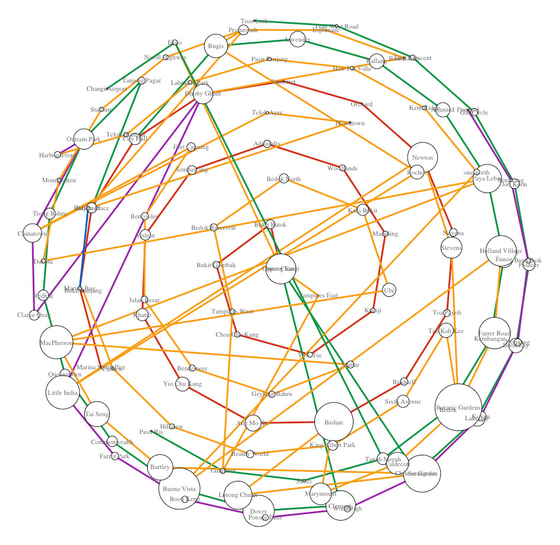

## Introduction to basic Network Analysis using railway (Singapore MRT) stations ##

This demo will provide 

- a brief introduction to web scraping using Rvest package
- a brief introduction to the concept of graph and network analysis using R igraph package
- a brief introduction on the metrics used to perform network analysis (such as degree, betweeness, closeness and eigenvector centrality)
- investigation into which MRT station is an important node in the Singapore MRT network


Installing the rvest package to scrape the list of MRT stations from wikipedia


```R
install.packages("rvest")
library(rvest)
```

    Installing package into '/home/nbcommon/R'
    (as 'lib' is unspecified)
    also installing the dependencies 'xml2', 'selectr'
    
    Loading required package: xml2


Before we can scrape the MRT stations data, we would need to ascertain the correct [XPath](https://www.w3schools.com/xml/xpath_intro.asp) to use.

1. navigate to the [wikipedia page](https://en.wikipedia.org/wiki/List_of_Singapore_MRT_stations) and fire up the developer tool (*F12 for windows or right-click &gt; Inspect*) 
2. copy the table XPath


Now we are ready to do some real and dirty work, scraping and cleaning the data!

### Data Scraping 


```R
url <- "https://en.wikipedia.org/wiki/List_of_Singapore_MRT_stations"
```


```R
mrt_stn <-  url %>%
  read_html() %>%
  #paste the copied xpath: html_nodes(xpath here)
  html_nodes(xpath='//*[@id="mw-content-text"]/div/table[2]') %>% 
  html_table(fill = TRUE)
```


```R
mrt <- mrt_stn[[1]]
```

### Data Cleaning


```R
mrt <- mrt[,c(1:2,5,7:8)] 
names(mrt) <- c("Code","Name","Opening","Status","Location")
```


```R
mrt <- subset(mrt,Code != Name)
```


```R
mrt <- mrt[2:nrow(mrt),]
```


```R
mrt$Code <- substr(mrt$Code, 1, 4)
mrt$Code <- iconv(mrt$Code, "ASCII", "UTF-8", sub="")
mrt$Name <- gsub('\\[.\\]',"",mrt$Name)
```


```R
mrt <- mrt[mrt$Name != 'Reserved Station',]
mrt <- mrt[mrt$Name != 'Punggol Coast',]
mrt <- mrt[mrt$Status != 'TBA',]
```

### Generating the MRT network's edgelist

i. preparing the North-South Line (NSL) edgelist


```R
ns_df <- mrt[substr(mrt$Code,1,2) == 'NS',]

sourceList <- ""
targetList <- ""
for (i in 1:nrow(ns_df)-1) {
  sourceList[i] <- ns_df$Name[i]
  targetList[i] <- ns_df$Name[i+1]
}

ns_edgelist <- data.frame(sourceList, targetList, "NSL")
names(ns_edgelist) <- c("source", "target", "network")
```

ii. preparing the East-West Line (EWL) edgelist


```R
ew_df <- mrt[substr(mrt$Code,1,2) == 'EW',]

sourceList <- ""
targetList <- ""
for (i in 1:nrow(ew_df)-1) {
  sourceList[i] <- ew_df$Name[i]
  targetList[i] <- ew_df$Name[i+1]
}

ew_edgelist <- data.frame(sourceList, targetList, "EWL")
names(ew_edgelist) <- c("source", "target", "network")
```

iii. preparing the Changi Airport Branch Line (CAL) edgelist


```R
cg_df <- mrt[substr(mrt$Code,1,2) == 'CG',]

sourceList <- ""
targetList <- ""
for (i in 1:nrow(cg_df)-1) {
  sourceList[i] <- cg_df$Name[i]
  targetList[i] <- cg_df$Name[i+1]
}

cg_edgelist <- data.frame(sourceList, targetList, "CAL")
names(cg_edgelist) <- c("source", "target", "network")
```

iv. preparing the North-East Line (NEL) edgelist


```R
ne_df <- mrt[substr(mrt$Code,1,2) == 'NE',]

sourceList <- ""
targetList <- ""
for (i in 1:nrow(ne_df)-1) {
  sourceList[i] <- ne_df$Name[i]
  targetList[i] <- ne_df$Name[i+1]
}

ne_edgelist <- data.frame(sourceList, targetList, "NEL")
names(ne_edgelist) <- c("source", "target", "network")
```

v. preparing the Circle Line (CCL) edgelist


```R
cc_df <- mrt[substr(mrt$Code,1,2) == 'CC',]

sourceList <- ""
targetList <- ""
for (i in 1:nrow(cc_df)-1) {
  sourceList[i] <- cc_df$Name[i]
  targetList[i] <- cc_df$Name[i+1]
}

cc_edgelist <- data.frame(sourceList, targetList, "CCL")
names(cc_edgelist) <- c("source", "target", "network")
```

vi. preparing the Downtown Line (DTL) edgelist


```R
dt_df <- mrt[substr(mrt$Code,1,2) == 'DT',]

sourceList <- ""
targetList <- ""
for (i in 1:nrow(dt_df)-1) {
  sourceList[i] <- dt_df$Name[i]
  targetList[i] <- dt_df$Name[i+1]
}

dt_edgelist <- data.frame(sourceList, targetList, "DTL")
names(dt_edgelist) <- c("source", "target", "network")
```


```R
mrt_edgelist <- rbind(ns_edgelist,ew_edgelist,cg_edgelist,ne_edgelist,cc_edgelist,dt_edgelist)
```


```R
mrt_edgelist
```


<table>
<thead><tr><th>source</th><th>target</th><th>network</th></tr></thead>
<tbody>
	<tr><td>Jurong East      </td><td>Bukit Batok      </td><td>NSL              </td></tr>
	<tr><td>Bukit Batok      </td><td>Bukit Gombak     </td><td>NSL              </td></tr>
	<tr><td>Bukit Gombak     </td><td>Choa Chu Kang    </td><td>NSL              </td></tr>
	<tr><td>Choa Chu Kang    </td><td>Yew Tee          </td><td>NSL              </td></tr>
	<tr><td>Yew Tee          </td><td>Kranji           </td><td>NSL              </td></tr>
	<tr><td>Kranji           </td><td>Marsiling        </td><td>NSL              </td></tr>
	<tr><td>Marsiling        </td><td>Woodlands        </td><td>NSL              </td></tr>
	<tr><td>Woodlands        </td><td>Admiralty        </td><td>NSL              </td></tr>
	<tr><td>Admiralty        </td><td>Sembawang        </td><td>NSL              </td></tr>
	<tr><td>Sembawang        </td><td>Yishun           </td><td>NSL              </td></tr>
	<tr><td>Yishun           </td><td>Khatib           </td><td>NSL              </td></tr>
	<tr><td>Khatib           </td><td>Yio Chu Kang     </td><td>NSL              </td></tr>
	<tr><td>Yio Chu Kang     </td><td>Ang Mo Kio       </td><td>NSL              </td></tr>
	<tr><td>Ang Mo Kio       </td><td>Bishan           </td><td>NSL              </td></tr>
	<tr><td>Bishan           </td><td>Braddell         </td><td>NSL              </td></tr>
	<tr><td>Braddell         </td><td>Toa Payoh        </td><td>NSL              </td></tr>
	<tr><td>Toa Payoh        </td><td>Novena           </td><td>NSL              </td></tr>
	<tr><td>Novena           </td><td>Newton           </td><td>NSL              </td></tr>
	<tr><td>Newton           </td><td>Orchard          </td><td>NSL              </td></tr>
	<tr><td>Orchard          </td><td>Somerset         </td><td>NSL              </td></tr>
	<tr><td>Somerset         </td><td>Dhoby Ghaut      </td><td>NSL              </td></tr>
	<tr><td>Dhoby Ghaut      </td><td>City Hall        </td><td>NSL              </td></tr>
	<tr><td>City Hall        </td><td>Raffles Place    </td><td>NSL              </td></tr>
	<tr><td>Raffles Place    </td><td>Marina Bay       </td><td>NSL              </td></tr>
	<tr><td>Marina Bay       </td><td>Marina South Pier</td><td>NSL              </td></tr>
	<tr><td>Pasir Ris        </td><td>Tampines         </td><td>EWL              </td></tr>
	<tr><td>Tampines         </td><td>Simei            </td><td>EWL              </td></tr>
	<tr><td>Simei            </td><td>Tanah Merah      </td><td>EWL              </td></tr>
	<tr><td>Tanah Merah      </td><td>Bedok            </td><td>EWL              </td></tr>
	<tr><td>Bedok            </td><td>Kembangan        </td><td>EWL              </td></tr>
	<tr><td>...</td><td>...</td><td>...</td></tr>
	<tr><td>Beauty World    </td><td>King Albert Park</td><td>DTL             </td></tr>
	<tr><td>King Albert Park</td><td>Sixth Avenue    </td><td>DTL             </td></tr>
	<tr><td>Sixth Avenue    </td><td>Tan Kah Kee     </td><td>DTL             </td></tr>
	<tr><td>Tan Kah Kee     </td><td>Botanic Gardens </td><td>DTL             </td></tr>
	<tr><td>Botanic Gardens </td><td>Stevens         </td><td>DTL             </td></tr>
	<tr><td>Stevens         </td><td>Newton          </td><td>DTL             </td></tr>
	<tr><td>Newton          </td><td>Little India    </td><td>DTL             </td></tr>
	<tr><td>Little India    </td><td>Rochor          </td><td>DTL             </td></tr>
	<tr><td>Rochor          </td><td>Bugis           </td><td>DTL             </td></tr>
	<tr><td>Bugis           </td><td>Promenade       </td><td>DTL             </td></tr>
	<tr><td>Promenade       </td><td>Bayfront        </td><td>DTL             </td></tr>
	<tr><td>Bayfront        </td><td>Downtown        </td><td>DTL             </td></tr>
	<tr><td>Downtown        </td><td>Telok Ayer      </td><td>DTL             </td></tr>
	<tr><td>Telok Ayer      </td><td>Chinatown       </td><td>DTL             </td></tr>
	<tr><td>Chinatown       </td><td>Fort Canning    </td><td>DTL             </td></tr>
	<tr><td>Fort Canning    </td><td>Bencoolen       </td><td>DTL             </td></tr>
	<tr><td>Bencoolen       </td><td>Jalan Besar     </td><td>DTL             </td></tr>
	<tr><td>Jalan Besar     </td><td>Bendemeer       </td><td>DTL             </td></tr>
	<tr><td>Bendemeer       </td><td>Geylang Bahru   </td><td>DTL             </td></tr>
	<tr><td>Geylang Bahru   </td><td>Mattar          </td><td>DTL             </td></tr>
	<tr><td>Mattar          </td><td>MacPherson      </td><td>DTL             </td></tr>
	<tr><td>MacPherson      </td><td>Ubi             </td><td>DTL             </td></tr>
	<tr><td>Ubi             </td><td>Kaki Bukit      </td><td>DTL             </td></tr>
	<tr><td>Kaki Bukit      </td><td>Bedok North     </td><td>DTL             </td></tr>
	<tr><td>Bedok North     </td><td>Bedok Reservoir </td><td>DTL             </td></tr>
	<tr><td>Bedok Reservoir </td><td>Tampines West   </td><td>DTL             </td></tr>
	<tr><td>Tampines West   </td><td>Tampines        </td><td>DTL             </td></tr>
	<tr><td>Tampines        </td><td>Tampines East   </td><td>DTL             </td></tr>
	<tr><td>Tampines East   </td><td>Upper Changi    </td><td>DTL             </td></tr>
	<tr><td>Upper Changi    </td><td>Expo            </td><td>DTL             </td></tr>
</tbody>
</table>


```R
mrt_edgelist$target <- as.character(mrt_edgelist$target)
mrt_edgelist$source <- as.character(mrt_edgelist$source)
mrt_edgelist$network <- as.character(mrt_edgelist$network)
```

Closing the loop for the graph network 


```R
mrt_edgelist[nrow(mrt_edgelist)+1,] <- c("Bayfront","Marina Bay","CEL")
mrt_edgelist[nrow(mrt_edgelist)+1,] <- c("Bayfront","Promenade","CCL")
mrt_edgelist[nrow(mrt_edgelist)+1,] <- c("Tanah Merah","Expo","CAL")
```

Specifying this network to be a undirected graph network


```R
mrt_edgelist$type <- "undirected"
```

Exporting the mrt edgelist to csv


```R
write.csv(mrt_edgelist, file="mrt_edgelist.csv", row.names=F)
```

### Generating the MRT network's nodelist


```R
mrt_node <- mrt[substr(mrt$Code,1,2) != 'TE',]
names(mrt_node)[2] <- "id"
mrt_node$label <- mrt_node$id

# removing duplicated mrt names/nodes (nodes in a network should be unique)
mrt_nodes <- unique(mrt_node)
mrt_nodes <- mrt_nodes[!duplicated(mrt_nodes$id),]
mrt_nodes$Code <- substr(mrt_nodes$Code, 1, 2)
```

Exporting the mrt nodes to csv


```R
write.csv(mrt_nodes, file="mrt_nodes.csv", row.names=F)
```

### Visualisation of the MRT network using Gephi


### Visualisation of the MRT network using R igraph package

Installing the igraph package to do graph network analysis and plotting


```R
install.packages("igraph")
library(igraph)
```

    Installing package into '/home/nbcommon/R'
    (as 'lib' is unspecified)
    
    Attaching package: 'igraph'
    
    The following objects are masked from 'package:stats':
    
        decompose, spectrum
    
    The following object is masked from 'package:base':
    
        union
    


```R
# renaming for igraph edgelist format
names(mrt_edgelist) <- c("from","to","network","type")
# rearranging for igraph nodelist format
mrt_nodes <- mrt_nodes[c(2,6,1,3,4,5)]
```

Setting up the graph network


```R
g = graph.data.frame(mrt_edgelist, mrt_nodes, directed=F)
# Removing self loops
# g = simplify(g, remove.loops = T)
```

Checking if multiple edges exists in the graph network


```R
any_multiple(g)
which_multiple(g)
#count_multiple(g)
#which_multiple(simplify(g))
#all(count_multiple(simplify(g)) == 1)
E(g)[38]
E(g)[135]
```


TRUE


<ol class="list-inline">
	<li>FALSE</li>
	<li>FALSE</li>
	<li>FALSE</li>
	<li>FALSE</li>
	<li>FALSE</li>
	<li>FALSE</li>
	<li>FALSE</li>
	<li>FALSE</li>
	<li>FALSE</li>
	<li>FALSE</li>
	<li>FALSE</li>
	<li>FALSE</li>
	<li>FALSE</li>
	<li>FALSE</li>
	<li>FALSE</li>
	<li>FALSE</li>
	<li>FALSE</li>
	<li>FALSE</li>
	<li>FALSE</li>
	<li>FALSE</li>
	<li>FALSE</li>
	<li>FALSE</li>
	<li>FALSE</li>
	<li>FALSE</li>
	<li>FALSE</li>
	<li>FALSE</li>
	<li>FALSE</li>
	<li>FALSE</li>
	<li>FALSE</li>
	<li>FALSE</li>
	<li>FALSE</li>
	<li>FALSE</li>
	<li>FALSE</li>
	<li>FALSE</li>
	<li>FALSE</li>
	<li>FALSE</li>
	<li>FALSE</li>
	<li>TRUE</li>
	<li>FALSE</li>
	<li>FALSE</li>
	<li>FALSE</li>
	<li>FALSE</li>
	<li>FALSE</li>
	<li>FALSE</li>
	<li>FALSE</li>
	<li>FALSE</li>
	<li>FALSE</li>
	<li>FALSE</li>
	<li>FALSE</li>
	<li>FALSE</li>
	<li>FALSE</li>
	<li>FALSE</li>
	<li>FALSE</li>
	<li>FALSE</li>
	<li>FALSE</li>
	<li>FALSE</li>
	<li>FALSE</li>
	<li>FALSE</li>
	<li>FALSE</li>
	<li>FALSE</li>
	<li>FALSE</li>
	<li>FALSE</li>
	<li>FALSE</li>
	<li>FALSE</li>
	<li>FALSE</li>
	<li>FALSE</li>
	<li>FALSE</li>
	<li>FALSE</li>
	<li>FALSE</li>
	<li>FALSE</li>
	<li>FALSE</li>
	<li>FALSE</li>
	<li>FALSE</li>
	<li>FALSE</li>
	<li>FALSE</li>
	<li>FALSE</li>
	<li>FALSE</li>
	<li>FALSE</li>
	<li>FALSE</li>
	<li>FALSE</li>
	<li>FALSE</li>
	<li>FALSE</li>
	<li>FALSE</li>
	<li>FALSE</li>
	<li>FALSE</li>
	<li>FALSE</li>
	<li>FALSE</li>
	<li>FALSE</li>
	<li>FALSE</li>
	<li>FALSE</li>
	<li>FALSE</li>
	<li>FALSE</li>
	<li>FALSE</li>
	<li>FALSE</li>
	<li>FALSE</li>
	<li>FALSE</li>
	<li>FALSE</li>
	<li>FALSE</li>
	<li>FALSE</li>
	<li>FALSE</li>
	<li>FALSE</li>
	<li>FALSE</li>
	<li>FALSE</li>
	<li>FALSE</li>
	<li>FALSE</li>
	<li>FALSE</li>
	<li>FALSE</li>
	<li>FALSE</li>
	<li>FALSE</li>
	<li>FALSE</li>
	<li>FALSE</li>
	<li>FALSE</li>
	<li>FALSE</li>
	<li>FALSE</li>
	<li>FALSE</li>
	<li>FALSE</li>
	<li>FALSE</li>
	<li>FALSE</li>
	<li>FALSE</li>
	<li>FALSE</li>
	<li>FALSE</li>
	<li>FALSE</li>
	<li>FALSE</li>
	<li>FALSE</li>
	<li>FALSE</li>
	<li>FALSE</li>
	<li>FALSE</li>
	<li>FALSE</li>
	<li>FALSE</li>
	<li>FALSE</li>
	<li>FALSE</li>
	<li>FALSE</li>
	<li>FALSE</li>
	<li>FALSE</li>
	<li>TRUE</li>
	<li>FALSE</li>
</ol>


    + 1/136 edge from d7df987 (vertex names):
    [1] City Hall--Raffles Place


    + 1/136 edge from d7df987 (vertex names):
    [1] Promenade--Bayfront


Removing multiple edges to create a simplified graph 


```R
simple_g <- g
```


```R
simple_g <- delete_edges(simple_g,c(38,135))
```


```R
any_multiple(simple_g)
```


FALSE


Displaying descriptive statistics of the graph network


```R
V(simple_g)
```


    + 119/119 vertices, named, from 24e1b48:
      [1] Jurong East       Bukit Batok       Bukit Gombak      Choa Chu Kang    
      [5] Yew Tee           Kranji            Marsiling         Woodlands        
      [9] Admiralty         Sembawang         Yishun            Khatib           
     [13] Yio Chu Kang      Ang Mo Kio        Bishan            Braddell         
     [17] Toa Payoh         Novena            Newton            Orchard          
     [21] Somerset          Dhoby Ghaut       City Hall         Raffles Place    
     [25] Marina Bay        Marina South Pier Pasir Ris         Tampines         
     [29] Simei             Tanah Merah       Bedok             Kembangan        
     [33] Eunos             Paya Lebar        Aljunied          Kallang          
     [37] Lavender          Bugis             Tanjong Pagar     Outram Park      
    + ... omitted several vertices


```R
E(simple_g)
```


    + 134/134 edges from 24e1b48 (vertex names):
     [1] Jurong East  --Bukit Batok   Bukit Batok  --Bukit Gombak 
     [3] Bukit Gombak --Choa Chu Kang Choa Chu Kang--Yew Tee      
     [5] Yew Tee      --Kranji        Kranji       --Marsiling    
     [7] Marsiling    --Woodlands     Woodlands    --Admiralty    
     [9] Admiralty    --Sembawang     Sembawang    --Yishun       
    [11] Yishun       --Khatib        Khatib       --Yio Chu Kang 
    [13] Yio Chu Kang --Ang Mo Kio    Ang Mo Kio   --Bishan       
    [15] Bishan       --Braddell      Braddell     --Toa Payoh    
    [17] Toa Payoh    --Novena        Novena       --Newton       
    [19] Newton       --Orchard       Orchard      --Somerset     
    + ... omitted several edges


```R
# Network Size (num of nodes and edges)
summary(simple_g)
# Network Density
graph.density(simple_g,loop=FALSE)
# greatest distance between any pair of vertices
diameter(simple_g)
# Average Path Length
mean_distance(simple_g, directed=F)
```

    IGRAPH 24e1b48 UN-- 119 134 -- 
    + attr: name (v/c), label (v/c), Code (v/c), Opening (v/c), Status
    | (v/c), Location (v/c), network (e/c), type (e/c)


0.0190856003418316


30


10.0371741917106


```R
# Length of all paths in the graph
distances(simple_g)
```


<table>
<thead><tr><th></th><th>Jurong East</th><th>Bukit Batok</th><th>Bukit Gombak</th><th>Choa Chu Kang</th><th>Yew Tee</th><th>Kranji</th><th>Marsiling</th><th>Woodlands</th><th>Admiralty</th><th>Sembawang</th><th>...</th><th>Bendemeer</th><th>Geylang Bahru</th><th>Mattar</th><th>Ubi</th><th>Kaki Bukit</th><th>Bedok North</th><th>Bedok Reservoir</th><th>Tampines West</th><th>Tampines East</th><th>Upper Changi</th></tr></thead>
<tbody>
	<tr><th>Jurong East</th><td> 0 </td><td> 1 </td><td> 2 </td><td> 3 </td><td> 4 </td><td> 5 </td><td> 6 </td><td> 7 </td><td> 8 </td><td> 9 </td><td>...</td><td>13 </td><td>14 </td><td>15 </td><td>15 </td><td>16 </td><td>17 </td><td>18 </td><td>19 </td><td>21 </td><td>21 </td></tr>
	<tr><th>Bukit Batok</th><td> 1 </td><td> 0 </td><td> 1 </td><td> 2 </td><td> 3 </td><td> 4 </td><td> 5 </td><td> 6 </td><td> 7 </td><td> 8 </td><td>...</td><td>14 </td><td>15 </td><td>16 </td><td>16 </td><td>17 </td><td>18 </td><td>19 </td><td>20 </td><td>22 </td><td>22 </td></tr>
	<tr><th>Bukit Gombak</th><td> 2 </td><td> 1 </td><td> 0 </td><td> 1 </td><td> 2 </td><td> 3 </td><td> 4 </td><td> 5 </td><td> 6 </td><td> 7 </td><td>...</td><td>15 </td><td>16 </td><td>17 </td><td>17 </td><td>18 </td><td>19 </td><td>20 </td><td>21 </td><td>23 </td><td>23 </td></tr>
	<tr><th>Choa Chu Kang</th><td> 3 </td><td> 2 </td><td> 1 </td><td> 0 </td><td> 1 </td><td> 2 </td><td> 3 </td><td> 4 </td><td> 5 </td><td> 6 </td><td>...</td><td>16 </td><td>17 </td><td>17 </td><td>17 </td><td>18 </td><td>19 </td><td>20 </td><td>21 </td><td>23 </td><td>23 </td></tr>
	<tr><th>Yew Tee</th><td> 4 </td><td> 3 </td><td> 2 </td><td> 1 </td><td> 0 </td><td> 1 </td><td> 2 </td><td> 3 </td><td> 4 </td><td> 5 </td><td>...</td><td>17 </td><td>17 </td><td>16 </td><td>16 </td><td>17 </td><td>18 </td><td>19 </td><td>20 </td><td>22 </td><td>22 </td></tr>
	<tr><th>Kranji</th><td> 5 </td><td> 4 </td><td> 3 </td><td> 2 </td><td> 1 </td><td> 0 </td><td> 1 </td><td> 2 </td><td> 3 </td><td> 4 </td><td>...</td><td>17 </td><td>16 </td><td>15 </td><td>15 </td><td>16 </td><td>17 </td><td>18 </td><td>19 </td><td>21 </td><td>21 </td></tr>
	<tr><th>Marsiling</th><td> 6 </td><td> 5 </td><td> 4 </td><td> 3 </td><td> 2 </td><td> 1 </td><td> 0 </td><td> 1 </td><td> 2 </td><td> 3 </td><td>...</td><td>16 </td><td>15 </td><td>14 </td><td>14 </td><td>15 </td><td>16 </td><td>17 </td><td>18 </td><td>20 </td><td>20 </td></tr>
	<tr><th>Woodlands</th><td> 7 </td><td> 6 </td><td> 5 </td><td> 4 </td><td> 3 </td><td> 2 </td><td> 1 </td><td> 0 </td><td> 1 </td><td> 2 </td><td>...</td><td>15 </td><td>14 </td><td>13 </td><td>13 </td><td>14 </td><td>15 </td><td>16 </td><td>17 </td><td>19 </td><td>19 </td></tr>
	<tr><th>Admiralty</th><td> 8 </td><td> 7 </td><td> 6 </td><td> 5 </td><td> 4 </td><td> 3 </td><td> 2 </td><td> 1 </td><td> 0 </td><td> 1 </td><td>...</td><td>14 </td><td>13 </td><td>12 </td><td>12 </td><td>13 </td><td>14 </td><td>15 </td><td>16 </td><td>18 </td><td>18 </td></tr>
	<tr><th>Sembawang</th><td> 9 </td><td> 8 </td><td> 7 </td><td> 6 </td><td> 5 </td><td> 4 </td><td> 3 </td><td> 2 </td><td> 1 </td><td> 0 </td><td>...</td><td>13 </td><td>12 </td><td>11 </td><td>11 </td><td>12 </td><td>13 </td><td>14 </td><td>15 </td><td>17 </td><td>17 </td></tr>
	<tr><th>Yishun</th><td>10 </td><td> 9 </td><td> 8 </td><td> 7 </td><td> 6 </td><td> 5 </td><td> 4 </td><td> 3 </td><td> 2 </td><td> 1 </td><td>...</td><td>12 </td><td>11 </td><td>10 </td><td>10 </td><td>11 </td><td>12 </td><td>13 </td><td>14 </td><td>16 </td><td>16 </td></tr>
	<tr><th>Khatib</th><td>11 </td><td>10 </td><td> 9 </td><td> 8 </td><td> 7 </td><td> 6 </td><td> 5 </td><td> 4 </td><td> 3 </td><td> 2 </td><td>...</td><td>11 </td><td>10 </td><td> 9 </td><td> 9 </td><td>10 </td><td>11 </td><td>12 </td><td>13 </td><td>15 </td><td>15 </td></tr>
	<tr><th>Yio Chu Kang</th><td>11 </td><td>11 </td><td>10 </td><td> 9 </td><td> 8 </td><td> 7 </td><td> 6 </td><td> 5 </td><td> 4 </td><td> 3 </td><td>...</td><td>10 </td><td> 9 </td><td> 8 </td><td> 8 </td><td> 9 </td><td>10 </td><td>11 </td><td>12 </td><td>14 </td><td>14 </td></tr>
	<tr><th>Ang Mo Kio</th><td>10 </td><td>11 </td><td>11 </td><td>10 </td><td> 9 </td><td> 8 </td><td> 7 </td><td> 6 </td><td> 5 </td><td> 4 </td><td>...</td><td> 9 </td><td> 8 </td><td> 7 </td><td> 7 </td><td> 8 </td><td> 9 </td><td>10 </td><td>11 </td><td>13 </td><td>13 </td></tr>
	<tr><th>Bishan</th><td> 9 </td><td>10 </td><td>11 </td><td>11 </td><td>10 </td><td> 9 </td><td> 8 </td><td> 7 </td><td> 6 </td><td> 5 </td><td>...</td><td> 8 </td><td> 7 </td><td> 6 </td><td> 6 </td><td> 7 </td><td> 8 </td><td> 9 </td><td>10 </td><td>12 </td><td>12 </td></tr>
	<tr><th>Braddell</th><td>10 </td><td>11 </td><td>12 </td><td>12 </td><td>11 </td><td>10 </td><td> 9 </td><td> 8 </td><td> 7 </td><td> 6 </td><td>...</td><td> 9 </td><td> 8 </td><td> 7 </td><td> 7 </td><td> 8 </td><td> 9 </td><td>10 </td><td>11 </td><td>13 </td><td>13 </td></tr>
	<tr><th>Toa Payoh</th><td>10 </td><td>11 </td><td>12 </td><td>13 </td><td>12 </td><td>11 </td><td>10 </td><td> 9 </td><td> 8 </td><td> 7 </td><td>...</td><td>10 </td><td> 9 </td><td> 8 </td><td> 8 </td><td> 9 </td><td>10 </td><td>11 </td><td>12 </td><td>14 </td><td>14 </td></tr>
	<tr><th>Novena</th><td> 9 </td><td>10 </td><td>11 </td><td>12 </td><td>13 </td><td>12 </td><td>11 </td><td>10 </td><td> 9 </td><td> 8 </td><td>...</td><td> 9 </td><td>10 </td><td> 9 </td><td> 9 </td><td>10 </td><td>11 </td><td>12 </td><td>13 </td><td>15 </td><td>14 </td></tr>
	<tr><th>Newton</th><td> 8 </td><td> 9 </td><td>10 </td><td>11 </td><td>12 </td><td>13 </td><td>12 </td><td>11 </td><td>10 </td><td> 9 </td><td>...</td><td> 8 </td><td> 9 </td><td> 9 </td><td> 9 </td><td>10 </td><td>11 </td><td>12 </td><td>13 </td><td>14 </td><td>13 </td></tr>
	<tr><th>Orchard</th><td> 9 </td><td>10 </td><td>11 </td><td>12 </td><td>13 </td><td>14 </td><td>13 </td><td>12 </td><td>11 </td><td>10 </td><td>...</td><td> 8 </td><td> 9 </td><td>10 </td><td>10 </td><td>11 </td><td>12 </td><td>13 </td><td>14 </td><td>15 </td><td>14 </td></tr>
	<tr><th>Somerset</th><td>10 </td><td>11 </td><td>12 </td><td>13 </td><td>14 </td><td>15 </td><td>14 </td><td>13 </td><td>12 </td><td>11 </td><td>...</td><td> 7 </td><td> 8 </td><td> 9 </td><td> 9 </td><td>10 </td><td>11 </td><td>12 </td><td>13 </td><td>14 </td><td>13 </td></tr>
	<tr><th>Dhoby Ghaut</th><td>10 </td><td>11 </td><td>12 </td><td>13 </td><td>14 </td><td>15 </td><td>14 </td><td>13 </td><td>12 </td><td>11 </td><td>...</td><td> 6 </td><td> 7 </td><td> 8 </td><td> 8 </td><td> 9 </td><td>10 </td><td>11 </td><td>12 </td><td>13 </td><td>12 </td></tr>
	<tr><th>City Hall</th><td>11 </td><td>12 </td><td>13 </td><td>14 </td><td>15 </td><td>16 </td><td>15 </td><td>14 </td><td>13 </td><td>12 </td><td>...</td><td> 7 </td><td> 8 </td><td> 7 </td><td> 7 </td><td> 8 </td><td> 9 </td><td>10 </td><td>11 </td><td>12 </td><td>11 </td></tr>
	<tr><th>Raffles Place</th><td>10 </td><td>11 </td><td>12 </td><td>13 </td><td>14 </td><td>15 </td><td>16 </td><td>15 </td><td>14 </td><td>13 </td><td>...</td><td> 7 </td><td> 8 </td><td> 8 </td><td> 8 </td><td> 9 </td><td>10 </td><td>11 </td><td>12 </td><td>13 </td><td>12 </td></tr>
	<tr><th>Marina Bay</th><td>11 </td><td>12 </td><td>13 </td><td>14 </td><td>15 </td><td>16 </td><td>17 </td><td>16 </td><td>15 </td><td>14 </td><td>...</td><td> 8 </td><td> 9 </td><td> 9 </td><td> 9 </td><td>10 </td><td>11 </td><td>12 </td><td>13 </td><td>14 </td><td>13 </td></tr>
	<tr><th>Marina South Pier</th><td>12 </td><td>13 </td><td>14 </td><td>15 </td><td>16 </td><td>17 </td><td>18 </td><td>17 </td><td>16 </td><td>15 </td><td>...</td><td> 9 </td><td>10 </td><td>10 </td><td>10 </td><td>11 </td><td>12 </td><td>13 </td><td>14 </td><td>15 </td><td>14 </td></tr>
	<tr><th>Pasir Ris</th><td>21 </td><td>22 </td><td>23 </td><td>23 </td><td>22 </td><td>21 </td><td>20 </td><td>19 </td><td>18 </td><td>17 </td><td>...</td><td>10 </td><td> 9 </td><td> 8 </td><td> 6 </td><td> 5 </td><td> 4 </td><td> 3 </td><td> 2 </td><td> 2 </td><td> 3 </td></tr>
	<tr><th>Tampines</th><td>20 </td><td>21 </td><td>22 </td><td>22 </td><td>21 </td><td>20 </td><td>19 </td><td>18 </td><td>17 </td><td>16 </td><td>...</td><td> 9 </td><td> 8 </td><td> 7 </td><td> 5 </td><td> 4 </td><td> 3 </td><td> 2 </td><td> 1 </td><td> 1 </td><td> 2 </td></tr>
	<tr><th>Simei</th><td>20 </td><td>21 </td><td>22 </td><td>22 </td><td>21 </td><td>20 </td><td>19 </td><td>18 </td><td>17 </td><td>16 </td><td>...</td><td> 9 </td><td> 8 </td><td> 7 </td><td> 6 </td><td> 5 </td><td> 4 </td><td> 3 </td><td> 2 </td><td> 2 </td><td> 3 </td></tr>
	<tr><th>Tanah Merah</th><td>19 </td><td>20 </td><td>21 </td><td>21 </td><td>20 </td><td>19 </td><td>18 </td><td>17 </td><td>16 </td><td>15 </td><td>...</td><td> 8 </td><td> 7 </td><td> 6 </td><td> 6 </td><td> 6 </td><td> 5 </td><td> 4 </td><td> 3 </td><td> 3 </td><td> 2 </td></tr>
	<tr><th>...</th><td>...</td><td>...</td><td>...</td><td>...</td><td>...</td><td>...</td><td>...</td><td>...</td><td>...</td><td>...</td><td>   </td><td>...</td><td>...</td><td>...</td><td>...</td><td>...</td><td>...</td><td>...</td><td>...</td><td>...</td><td>...</td></tr>
	<tr><th>Kent Ridge</th><td> 5 </td><td> 6 </td><td> 7 </td><td> 8 </td><td> 9 </td><td>10 </td><td>11 </td><td>12 </td><td>13 </td><td>13 </td><td>...</td><td>11 </td><td>12 </td><td>13 </td><td>14 </td><td>15 </td><td>16 </td><td>17 </td><td>18 </td><td>20 </td><td>20 </td></tr>
	<tr><th>Haw Par Villa</th><td> 6 </td><td> 7 </td><td> 8 </td><td> 9 </td><td>10 </td><td>11 </td><td>12 </td><td>13 </td><td>14 </td><td>14 </td><td>...</td><td>10 </td><td>11 </td><td>12 </td><td>14 </td><td>15 </td><td>16 </td><td>17 </td><td>18 </td><td>20 </td><td>19 </td></tr>
	<tr><th>Pasir Panjang</th><td> 7 </td><td> 8 </td><td> 9 </td><td>10 </td><td>11 </td><td>12 </td><td>13 </td><td>14 </td><td>15 </td><td>15 </td><td>...</td><td> 9 </td><td>10 </td><td>11 </td><td>13 </td><td>14 </td><td>15 </td><td>16 </td><td>17 </td><td>19 </td><td>18 </td></tr>
	<tr><th>Labrador Park</th><td> 8 </td><td> 9 </td><td>10 </td><td>11 </td><td>12 </td><td>13 </td><td>14 </td><td>15 </td><td>16 </td><td>16 </td><td>...</td><td> 8 </td><td> 9 </td><td>10 </td><td>12 </td><td>13 </td><td>14 </td><td>15 </td><td>16 </td><td>18 </td><td>17 </td></tr>
	<tr><th>Telok Blangah</th><td> 9 </td><td>10 </td><td>11 </td><td>12 </td><td>13 </td><td>14 </td><td>15 </td><td>16 </td><td>17 </td><td>16 </td><td>...</td><td> 7 </td><td> 8 </td><td> 9 </td><td>11 </td><td>12 </td><td>13 </td><td>14 </td><td>15 </td><td>17 </td><td>16 </td></tr>
	<tr><th>Bayfront</th><td>12 </td><td>13 </td><td>14 </td><td>15 </td><td>16 </td><td>17 </td><td>17 </td><td>16 </td><td>15 </td><td>14 </td><td>...</td><td> 7 </td><td> 8 </td><td> 8 </td><td> 8 </td><td> 9 </td><td>10 </td><td>11 </td><td>12 </td><td>13 </td><td>12 </td></tr>
	<tr><th>Bukit Panjang</th><td>13 </td><td>14 </td><td>15 </td><td>16 </td><td>17 </td><td>18 </td><td>18 </td><td>17 </td><td>16 </td><td>15 </td><td>...</td><td>17 </td><td>17 </td><td>16 </td><td>16 </td><td>17 </td><td>18 </td><td>19 </td><td>20 </td><td>22 </td><td>22 </td></tr>
	<tr><th>Cashew</th><td>12 </td><td>13 </td><td>14 </td><td>15 </td><td>16 </td><td>17 </td><td>17 </td><td>16 </td><td>15 </td><td>14 </td><td>...</td><td>16 </td><td>16 </td><td>15 </td><td>15 </td><td>16 </td><td>17 </td><td>18 </td><td>19 </td><td>21 </td><td>21 </td></tr>
	<tr><th>Hillview</th><td>11 </td><td>12 </td><td>13 </td><td>14 </td><td>15 </td><td>16 </td><td>16 </td><td>15 </td><td>14 </td><td>13 </td><td>...</td><td>15 </td><td>15 </td><td>14 </td><td>14 </td><td>15 </td><td>16 </td><td>17 </td><td>18 </td><td>20 </td><td>20 </td></tr>
	<tr><th>Beauty World</th><td>10 </td><td>11 </td><td>12 </td><td>13 </td><td>14 </td><td>15 </td><td>15 </td><td>14 </td><td>13 </td><td>12 </td><td>...</td><td>14 </td><td>14 </td><td>13 </td><td>13 </td><td>14 </td><td>15 </td><td>16 </td><td>17 </td><td>19 </td><td>19 </td></tr>
	<tr><th>King Albert Park</th><td> 9 </td><td>10 </td><td>11 </td><td>12 </td><td>13 </td><td>14 </td><td>14 </td><td>13 </td><td>12 </td><td>11 </td><td>...</td><td>13 </td><td>13 </td><td>12 </td><td>12 </td><td>13 </td><td>14 </td><td>15 </td><td>16 </td><td>18 </td><td>18 </td></tr>
	<tr><th>Sixth Avenue</th><td> 8 </td><td> 9 </td><td>10 </td><td>11 </td><td>12 </td><td>13 </td><td>13 </td><td>12 </td><td>11 </td><td>10 </td><td>...</td><td>12 </td><td>12 </td><td>11 </td><td>11 </td><td>12 </td><td>13 </td><td>14 </td><td>15 </td><td>17 </td><td>17 </td></tr>
	<tr><th>Tan Kah Kee</th><td> 7 </td><td> 8 </td><td> 9 </td><td>10 </td><td>11 </td><td>12 </td><td>12 </td><td>11 </td><td>10 </td><td> 9 </td><td>...</td><td>11 </td><td>11 </td><td>10 </td><td>10 </td><td>11 </td><td>12 </td><td>13 </td><td>14 </td><td>16 </td><td>16 </td></tr>
	<tr><th>Stevens</th><td> 7 </td><td> 8 </td><td> 9 </td><td>10 </td><td>11 </td><td>12 </td><td>12 </td><td>11 </td><td>10 </td><td> 9 </td><td>...</td><td> 9 </td><td>10 </td><td>10 </td><td>10 </td><td>11 </td><td>12 </td><td>13 </td><td>14 </td><td>15 </td><td>14 </td></tr>
	<tr><th>Rochor</th><td>10 </td><td>11 </td><td>12 </td><td>13 </td><td>14 </td><td>15 </td><td>14 </td><td>13 </td><td>12 </td><td>11 </td><td>...</td><td> 8 </td><td> 8 </td><td> 7 </td><td> 7 </td><td> 8 </td><td> 9 </td><td>10 </td><td>11 </td><td>12 </td><td>11 </td></tr>
	<tr><th>Downtown</th><td>11 </td><td>12 </td><td>13 </td><td>14 </td><td>15 </td><td>16 </td><td>17 </td><td>17 </td><td>16 </td><td>15 </td><td>...</td><td> 6 </td><td> 7 </td><td> 8 </td><td> 9 </td><td>10 </td><td>11 </td><td>12 </td><td>13 </td><td>14 </td><td>13 </td></tr>
	<tr><th>Telok Ayer</th><td>10 </td><td>11 </td><td>12 </td><td>13 </td><td>14 </td><td>15 </td><td>16 </td><td>16 </td><td>15 </td><td>14 </td><td>...</td><td> 5 </td><td> 6 </td><td> 7 </td><td> 9 </td><td>10 </td><td>11 </td><td>12 </td><td>13 </td><td>15 </td><td>14 </td></tr>
	<tr><th>Fort Canning</th><td>10 </td><td>11 </td><td>12 </td><td>13 </td><td>14 </td><td>15 </td><td>16 </td><td>16 </td><td>15 </td><td>14 </td><td>...</td><td> 3 </td><td> 4 </td><td> 5 </td><td> 7 </td><td> 8 </td><td> 9 </td><td>10 </td><td>11 </td><td>13 </td><td>13 </td></tr>
	<tr><th>Bencoolen</th><td>11 </td><td>12 </td><td>13 </td><td>14 </td><td>15 </td><td>16 </td><td>17 </td><td>17 </td><td>16 </td><td>15 </td><td>...</td><td> 2 </td><td> 3 </td><td> 4 </td><td> 6 </td><td> 7 </td><td> 8 </td><td> 9 </td><td>10 </td><td>12 </td><td>12 </td></tr>
	<tr><th>Jalan Besar</th><td>12 </td><td>13 </td><td>14 </td><td>15 </td><td>16 </td><td>17 </td><td>17 </td><td>16 </td><td>15 </td><td>14 </td><td>...</td><td> 1 </td><td> 2 </td><td> 3 </td><td> 5 </td><td> 6 </td><td> 7 </td><td> 8 </td><td> 9 </td><td>11 </td><td>11 </td></tr>
	<tr><th>Bendemeer</th><td>13 </td><td>14 </td><td>15 </td><td>16 </td><td>17 </td><td>17 </td><td>16 </td><td>15 </td><td>14 </td><td>13 </td><td>...</td><td> 0 </td><td> 1 </td><td> 2 </td><td> 4 </td><td> 5 </td><td> 6 </td><td> 7 </td><td> 8 </td><td>10 </td><td>10 </td></tr>
	<tr><th>Geylang Bahru</th><td>14 </td><td>15 </td><td>16 </td><td>17 </td><td>17 </td><td>16 </td><td>15 </td><td>14 </td><td>13 </td><td>12 </td><td>...</td><td> 1 </td><td> 0 </td><td> 1 </td><td> 3 </td><td> 4 </td><td> 5 </td><td> 6 </td><td> 7 </td><td> 9 </td><td> 9 </td></tr>
	<tr><th>Mattar</th><td>15 </td><td>16 </td><td>17 </td><td>17 </td><td>16 </td><td>15 </td><td>14 </td><td>13 </td><td>12 </td><td>11 </td><td>...</td><td> 2 </td><td> 1 </td><td> 0 </td><td> 2 </td><td> 3 </td><td> 4 </td><td> 5 </td><td> 6 </td><td> 8 </td><td> 8 </td></tr>
	<tr><th>Ubi</th><td>15 </td><td>16 </td><td>17 </td><td>17 </td><td>16 </td><td>15 </td><td>14 </td><td>13 </td><td>12 </td><td>11 </td><td>...</td><td> 4 </td><td> 3 </td><td> 2 </td><td> 0 </td><td> 1 </td><td> 2 </td><td> 3 </td><td> 4 </td><td> 6 </td><td> 7 </td></tr>
	<tr><th>Kaki Bukit</th><td>16 </td><td>17 </td><td>18 </td><td>18 </td><td>17 </td><td>16 </td><td>15 </td><td>14 </td><td>13 </td><td>12 </td><td>...</td><td> 5 </td><td> 4 </td><td> 3 </td><td> 1 </td><td> 0 </td><td> 1 </td><td> 2 </td><td> 3 </td><td> 5 </td><td> 6 </td></tr>
	<tr><th>Bedok North</th><td>17 </td><td>18 </td><td>19 </td><td>19 </td><td>18 </td><td>17 </td><td>16 </td><td>15 </td><td>14 </td><td>13 </td><td>...</td><td> 6 </td><td> 5 </td><td> 4 </td><td> 2 </td><td> 1 </td><td> 0 </td><td> 1 </td><td> 2 </td><td> 4 </td><td> 5 </td></tr>
	<tr><th>Bedok Reservoir</th><td>18 </td><td>19 </td><td>20 </td><td>20 </td><td>19 </td><td>18 </td><td>17 </td><td>16 </td><td>15 </td><td>14 </td><td>...</td><td> 7 </td><td> 6 </td><td> 5 </td><td> 3 </td><td> 2 </td><td> 1 </td><td> 0 </td><td> 1 </td><td> 3 </td><td> 4 </td></tr>
	<tr><th>Tampines West</th><td>19 </td><td>20 </td><td>21 </td><td>21 </td><td>20 </td><td>19 </td><td>18 </td><td>17 </td><td>16 </td><td>15 </td><td>...</td><td> 8 </td><td> 7 </td><td> 6 </td><td> 4 </td><td> 3 </td><td> 2 </td><td> 1 </td><td> 0 </td><td> 2 </td><td> 3 </td></tr>
	<tr><th>Tampines East</th><td>21 </td><td>22 </td><td>23 </td><td>23 </td><td>22 </td><td>21 </td><td>20 </td><td>19 </td><td>18 </td><td>17 </td><td>...</td><td>10 </td><td> 9 </td><td> 8 </td><td> 6 </td><td> 5 </td><td> 4 </td><td> 3 </td><td> 2 </td><td> 0 </td><td> 1 </td></tr>
	<tr><th>Upper Changi</th><td>21 </td><td>22 </td><td>23 </td><td>23 </td><td>22 </td><td>21 </td><td>20 </td><td>19 </td><td>18 </td><td>17 </td><td>...</td><td>10 </td><td> 9 </td><td> 8 </td><td> 7 </td><td> 6 </td><td> 5 </td><td> 4 </td><td> 3 </td><td> 1 </td><td> 0 </td></tr>
</tbody>
</table>


In graph theory and network analysis, indicators of centrality identify the most important vertices within a graph. Applications include identifying the most influential person(s) in a social network, key infrastructure nodes in the Internet or urban networks, and super-spreaders of disease. In this scenario, we could identify the important stations in the MRT network using different centrality measures.

Generation of graph attributes: **Degree Centrality** (_in-degree, out-degree and total degree_)

Since this is an undirected network, we will use the _total degree_ centrality measure.
[_in-degree_ and _out-degree_ will be relevant if it is a directed network graph]

**Degree centrality** measures how connected an entity is by counting the number of direct links each entity has to others in the network.


```R
V(simple_g)$degree=degree(simple_g, mode="all")
```

**Betweenness centrality** measures the number of paths that pass through each entity.


```R
V(simple_g)$betweenness=betweenness(simple_g,normalized=T)
```

Generation of graph attributes: **Closeness Centrality**

Closeness centrality (or closeness) of a node is a measure of centrality in a network, calculated as the sum of the length of the shortest paths between the node and all other nodes in the graph. Thus the more central a node is, the closer it is to all other nodes

**Closeness centrality** measures the proximity of an entity to the other entities in the social network.


```R
V(simple_g)$closeness=closeness(simple_g, normalized=T)
```

Generation of graph attributes: **Eigenvector**

**Eigenvector** measures how connected an entity is and how much direct influence it might have over other connected entities in the network.


```R
V(simple_g)$eigen=evcent(simple_g)$vector
```

**Coreness** is a measure that can help identify tightly interlinked groups within a network. A k-core is a maximal group of entities, all of which are connected to at least k other entities in the group.


```R
V(simple_g)$coreness=coreness(simple_g)
```


Specify graph layout to use


```R
glay = layout_with_lgl(simple_g)
```

Installing the plyr package for data mapping / transformation


```R
install.packages("plyr")
library(plyr)
```

    Installing package into '/home/nbcommon/R'
    (as 'lib' is unspecified)


```R
# Generate node colors based on network:
E(simple_g)$color <- mapvalues(E(simple_g)$network, c("NSL","EWL","CAL","NEL","CCL","DTL","CEL"), c("#D42E12","#009645","#009645","#9900AA","#FA9E0D","#FA9E0D","#005EC4"))
```


```R
# plot degree graph 
plot(simple_g, layout=glay, edge.color=E(simple_g)$color, edge.width=3, edge.curve=1, 
     vertex.label.cex=.7, vertex.color="white", vertex.frame.color="black", 
     vertex.label.font=1.5, vertex.label=V(simple_g)$label, vertex.label.color="grey40",
     vertex.size=V(simple_g)$degree*3.5) 
```


```R
V(simple_g)$name[degree(simple_g)==max(degree(simple_g))]
```


'Dhoby Ghaut'


```R
# plot closeness graph
plot(simple_g, layout=glay, edge.color=E(simple_g)$color, edge.width=3, edge.curve=1, 
     vertex.label.cex=.7, vertex.color="white", vertex.frame.color="black", 
     vertex.label.font=.7, vertex.label=V(simple_g)$label, vertex.label.color="grey40",
     vertex.size=V(simple_g)$closeness*90) 
```


```R
V(simple_g)$name[closeness(simple_g)==max(closeness(simple_g))]
```


'Little India'


```R
# plot betweenness graph
plot(simple_g, layout=glay, edge.color=E(simple_g)$color, edge.width=3, edge.curve=1, 
     vertex.label.cex=.7, vertex.color="white", vertex.frame.color="black", 
     vertex.label.font=1, vertex.label=V(simple_g)$label, vertex.label.color="grey40",
     vertex.size=V(simple_g)$betweenness*60) 
```




```R
V(simple_g)$name[betweenness(simple_g)==max(betweenness(simple_g))]
```


'Botanic Gardens'


```R
# plot eigenvector graph
plot(simple_g, layout=glay, edge.color=E(simple_g)$color, edge.width=3, edge.curve=1, 
     vertex.label.cex=.7, vertex.color="white", vertex.frame.color="black", 
     vertex.label.font=1, vertex.label=V(simple_g)$label, vertex.label.color="grey40",
     vertex.size=V(simple_g)$eigen*20)
```


```R
V(simple_g)$name[which.max(V(simple_g)$eigen)]
```


'Dhoby Ghaut'


```R
attr = data.frame(row.names=V(simple_g)$name,degree=V(simple_g)$degree,
                  coreness=V(simple_g)$coreness,betweenness=V(simple_g)$betweenness,
                  closeness=V(simple_g)$closeness,eigen=V(simple_g)$eigen)
```


```R
table(attr$degree)
table(attr$coreness)
table(attr$betweenness)
table(attr$closeness)
table(attr$eigen)
```


    
     1  2  3  4  5 
     6 92  7 13  1 


    
     1  2 
    24 95 


    
                      0 0.00195567144719687 0.00402964894490318  0.0047008547008547 
                      6                   1                   1                   1 
    0.00582114056690328  0.0068810662031001  0.0123293530073191  0.0127891255009899 
                      1                   1                   1                   1 
     0.0160534067313728  0.0169491525423729  0.0175975938687803  0.0226816498002939 
                      1                   3                   1                   1 
     0.0227057938922346  0.0232110952449936  0.0251684912701862  0.0258203817525851 
                      1                   1                   1                   1 
     0.0267399267399267  0.0270655270655271  0.0278960838282872  0.0288625373371136 
                      1                   1                   1                   1 
     0.0309630733359547  0.0317977690859047   0.033391279153991  0.0336085759814573 
                      1                   1                   1                   3 
     0.0344398225754158  0.0345308802935922  0.0345767540682795  0.0346226278429668 
                      1                   1                   1                   1 
     0.0353928243758752  0.0373026220483848  0.0386443437290895  0.0401395528514173 
                      1                   1                   1                   1 
     0.0412863972186006  0.0418948283355063  0.0421676565744362  0.0422087015307354 
                      1                   1                   1                   1 
     0.0424798051916696  0.0436163020908784  0.0445023902651021  0.0465739533536144 
                      1                   1                   1                   1 
     0.0471775556521319  0.0475807619875416  0.0482295482295482  0.0484378772514366 
                      1                   1                   1                   1 
     0.0486262011685741  0.0490656236418948  0.0493988121106765  0.0499782703172534 
                      1                   1                   1                   3 
     0.0505456564778599   0.052923849534019   0.056188130764402  0.0593220338983051 
                      1                   1                   1                   1 
     0.0604809503114588   0.062344874209281   0.066058235549761   0.066597338631237 
                      1                   1                   3                   1 
     0.0671326476411222  0.0689813952525817  0.0691848954560819  0.0705852527886426 
                      1                   1                   1                   1 
     0.0706214689265537  0.0744724515910957  0.0762518711671254  0.0766843953284631 
                      2                   1                   1                   1 
     0.0799845477811579  0.0818484716789802  0.0819209039548023  0.0904485972282583 
                      1                   2                   1                   1 
     0.0926601960500266  0.0941285017556204  0.0945241199478488   0.096830225643785 
                      1                   1                   1                   1 
     0.0973489787049109  0.0997275166766692   0.105159937363327   0.106567193007871 
                      2                   1                   1                   1 
      0.108431116905693   0.112559756627553   0.120474189965715   0.124850479087767 
                      1                   1                   1                   1 
      0.127480805446907   0.132674199623352   0.137474734932362   0.142346667770397 
                      1                   1                   1                   1 
      0.144993894993895   0.147746321475135    0.15777267302691   0.168727537371605 
                      1                   1                   1                   1 
      0.171709332726282   0.189225871429261   0.190974248601367    0.19911632623497 
                      1                   1                   1                   1 
      0.202158481819499   0.202221601374144   0.205202361982023   0.210415761263219 
                      1                   1                   1                   1 
      0.211503969978546   0.222513330987907   0.226112180349468   0.249501596959224 
                      1                   1                   1                   1 
      0.259219593965357   0.277175900057256   0.314647530749226 
                      1                   1                   1 


    
     0.053393665158371 0.0563784042044912 0.0596562184024267 0.0632707774798928 
                     1                  1                  1                  1 
    0.0672748004561003 0.0708708708708709 0.0711271850512357 0.0717325227963526 
                     1                  1                  1                  1 
    0.0718198417528911 0.0721271393643032 0.0727945712523134 0.0762273901808786 
                     1                  1                  1                  1 
    0.0767230169050715  0.077124183006536 0.0773263433813893 0.0776826859776168 
                     1                  1                  1                  1 
     0.077990746860542 0.0781456953642384 0.0784053156146179 0.0793544048419637 
                     1                  1                  1                  1 
    0.0794078061911171 0.0798376184032476 0.0809327846364883 0.0823447313328681 
                     1                  1                  1                  1 
    0.0830401125967628 0.0836286321757619 0.0838068181818182 0.0841654778887304 
                     1                  1                  1                  1 
     0.085383502170767 0.0861313868613139 0.0885221305326332 0.0887218045112782 
                     1                  1                  1                  1 
    0.0890566037735849 0.0899390243902439 0.0909090909090909 0.0917573872472784 
                     1                  1                  1                  1 
    0.0940239043824701 0.0960130187144019 0.0970394736842105 0.0972794723825227 
                     2                  1                  1                  1 
    0.0973597359735974 0.0988274706867672 0.0990764063811923 0.0991596638655462 
                     1                  1                  1                  1 
    0.0994102780117944  0.100254885301614  0.101636520241171  0.101811906816221 
                     1                  1                  1                  1 
      0.10251954821894  0.103327495621716  0.105357142857143  0.105545617173524 
                     1                  1                  1                  1 
     0.106594399277326  0.107175295186194    0.1073703366697  0.107468123861566 
                     1                  1                  1                  1 
     0.108058608058608  0.108256880733945   0.10865561694291  0.109158186864015 
                     1                  1                  1                  1 
     0.109461966604824  0.109767441860465  0.109869646182495  0.109972041006524 
                     1                  1                  1                  1 
     0.110383536014967  0.111848341232227  0.112060778727445  0.112595419847328 
                     1                  1                  1                  2 
     0.112702960840497  0.113026819923372  0.113461538461538  0.114451988360815 
                     1                  1                  1                  1 
           0.115234375   0.11545988258317  0.115572967678746  0.116370808678501 
                     1                  2                  1                  1 
     0.117647058823529  0.118592964824121  0.118712273641851  0.119071644803229 
                     1                  1                  2                  1 
     0.119312436804853  0.119433198380567  0.119918699186992  0.121025641025641 
                     1                  2                  1                  1 
     0.121274409044193  0.121524201853759  0.121900826446281  0.122026887280248 
                     1                  2                  1                  1 
     0.122279792746114  0.123044838373306  0.123430962343096  0.124341412012645 
                     1                  1                  1                  1 
     0.124604012671595  0.124867724867725   0.12566560170394  0.125933831376734 
                     1                  1                  1                  1 
     0.126473740621651  0.127292340884574  0.127843986998917  0.127982646420824 
                     1                  1                  1                  2 
     0.128121606948969   0.12910284463895  0.130099228224917  0.131403118040089 
                     1                  1                  1                  2 
     0.131843575418994  0.133182844243792  0.134090909090909  0.135476463834673 
                     1                  1                  1                  1 
     0.136258660508083  0.138173302107728  0.140979689366786 
                     1                  1                  1 


    
    2.51858362053298e-07 7.39028698759823e-07 1.91667562290336e-06 
                       1                    1                    1 
    4.88507796089859e-06 1.24176223479958e-05 2.10200818492998e-05 
                       1                    1                    1 
    2.67431016136541e-05 3.15519861450127e-05   3.493618354964e-05 
                       1                    1                    1 
    5.74522762701692e-05 8.01654591480061e-05 8.14932595885658e-05 
                       1                    1                    1 
    0.000141839273885244 0.000167809921265858 0.000177714640335611 
                       1                    1                    1 
    0.000185105863472294 0.000203677745616489 0.000204189716771217 
                       1                    1                    1 
    0.000223321313009527 0.000287174882385132 0.000321189495444625 
                       1                    1                    1 
    0.000358747103161553 0.000417817517967914 0.000492405122926692 
                       1                    1                    1 
    0.000517486721433531 0.000517661199389077 0.000521468567890903 
                       1                    1                    1 
    0.000543156654683785 0.000647439641568565 0.000655292355512262 
                       1                    1                    1 
    0.000704534547681859 0.000910833357740738  0.00127705581286622 
                       1                    1                    1 
     0.00131478499340561  0.00137831538939482  0.00140868023272799 
                       1                    1                    1 
     0.00164950018256149  0.00231391377469838  0.00274166271824377 
                       1                    1                    1 
     0.00282282937525379  0.00325486333280614   0.0035903377056515 
                       1                    1                    1 
     0.00378373757664514  0.00380690651505764  0.00413559846730773 
                       1                    1                    1 
     0.00587889032532363  0.00666655321918628   0.0069682511646331 
                       1                    1                    1 
     0.00729572527509893  0.00738687889451853    0.007573376213864 
                       1                    1                    1 
     0.00827369879931538  0.00912645777319788    0.010485598006559 
                       1                    1                    1 
      0.0105653985966293   0.0116571804822862   0.0124409387540652 
                       1                    1                    1 
       0.012822558121519   0.0133160285498551   0.0149365306059223 
                       1                    1                    1 
       0.016820023102403    0.017624129573429   0.0178684329563004 
                       1                    1                    1 
      0.0200011387088744   0.0208359090163346    0.021022674274045 
                       1                    1                    1 
      0.0231894529515193   0.0234287025398688   0.0246279983079351 
                       1                    1                    1 
      0.0256415713329211   0.0266323211910227   0.0281642727572974 
                       1                    1                    1 
      0.0324649884818062   0.0379494133507986   0.0399540168190206 
                       1                    1                    1 
      0.0426884877753544   0.0431176419956824   0.0450445140766606 
                       1                    1                    1 
      0.0458668393248469   0.0520506817733822    0.053413193322856 
                       1                    1                    1 
      0.0536443324331427   0.0546418749796778   0.0573126934639011 
                       1                    1                    1 
      0.0581815090184332   0.0885708045661908   0.0890729109251433 
                       1                    1                    1 
       0.105253358095607    0.114305811115643    0.114586056646666 
                       1                    1                    1 
       0.114720227435284    0.127090890274223     0.13570780879659 
                       1                    1                    1 
        0.14729346265851    0.188118280674737     0.19157545406345 
                       1                    1                    1 
       0.216775918415613    0.221412875690504    0.232840042447464 
                       1                    1                    1 
       0.249100008151929    0.282979552890921    0.290363348277626 
                       1                    1                    1 
       0.308845224052014    0.320872474237074    0.342513847439296 
                       1                    1                    1 
       0.347566516922269     0.36042054487175    0.374022111837471 
                       1                    1                    1 
       0.440571504738262    0.457523962582117    0.459245894439935 
                       1                    1                    1 
        0.46826186745292     0.52144365496715     0.54751538121932 
                       1                    1                    1 
       0.560619511605635    0.715627468790695    0.734824970607291 
                       1                    1                    1 
       0.814446111403723                    1 
                       1                    1 


```R
attr
```


<table>
<thead><tr><th></th><th>degree</th><th>coreness</th><th>betweenness</th><th>closeness</th><th>eigen</th></tr></thead>
<tbody>
	<tr><th>Jurong East</th><td>3           </td><td>2           </td><td>0.202158482 </td><td>0.09601302  </td><td>1.314785e-03</td></tr>
	<tr><th>Bukit Batok</th><td>2           </td><td>2           </td><td>0.060480950 </td><td>0.08905660  </td><td>5.176612e-04</td></tr>
	<tr><th>Bukit Gombak</th><td>2           </td><td>2           </td><td>0.046573953 </td><td>0.08304011  </td><td>2.041897e-04</td></tr>
	<tr><th>Choa Chu Kang</th><td>2           </td><td>2           </td><td>0.037302622 </td><td>0.07940781  </td><td>8.149326e-05</td></tr>
	<tr><th>Yew Tee</th><td>2           </td><td>2           </td><td>0.033391279 </td><td>0.07799075  </td><td>3.493618e-05</td></tr>
	<tr><th>Kranji</th><td>2           </td><td>2           </td><td>0.031797769 </td><td>0.07712418  </td><td>2.102008e-05</td></tr>
	<tr><th>Marsiling</th><td>2           </td><td>2           </td><td>0.034622628 </td><td>0.07840532  </td><td>2.674310e-05</td></tr>
	<tr><th>Woodlands</th><td>2           </td><td>2           </td><td>0.041286397 </td><td>0.08093278  </td><td>5.745228e-05</td></tr>
	<tr><th>Admiralty</th><td>2           </td><td>2           </td><td>0.049398812 </td><td>0.08416548  </td><td>1.418393e-04</td></tr>
	<tr><th>Sembawang</th><td>2           </td><td>2           </td><td>0.059322034 </td><td>0.08852213  </td><td>3.587471e-04</td></tr>
	<tr><th>Yishun</th><td>2           </td><td>2           </td><td>0.070621469 </td><td>0.09402390  </td><td>9.108334e-04</td></tr>
	<tr><th>Khatib</th><td>2           </td><td>2           </td><td>0.081920904 </td><td>0.10025489  </td><td>2.313914e-03</td></tr>
	<tr><th>Yio Chu Kang</th><td>2           </td><td>2           </td><td>0.094524120 </td><td>0.10825688  </td><td>5.878890e-03</td></tr>
	<tr><th>Ang Mo Kio</th><td>2           </td><td>2           </td><td>0.108431117 </td><td>0.11871227  </td><td>1.493653e-02</td></tr>
	<tr><th>Bishan</th><td>4           </td><td>2           </td><td>0.259219594 </td><td>0.13140312  </td><td>3.794941e-02</td></tr>
	<tr><th>Braddell</th><td>2           </td><td>2           </td><td>0.048626201 </td><td>0.12434141  </td><td>4.311764e-02</td></tr>
	<tr><th>Toa Payoh</th><td>2           </td><td>2           </td><td>0.047177556 </td><td>0.12304484  </td><td>8.857080e-02</td></tr>
	<tr><th>Novena</th><td>2           </td><td>2           </td><td>0.052923850 </td><td>0.12812161  </td><td>2.167759e-01</td></tr>
	<tr><th>Newton</th><td>4           </td><td>2           </td><td>0.202221601 </td><td>0.13817330  </td><td>5.475154e-01</td></tr>
	<tr><th>Orchard</th><td>2           </td><td>2           </td><td>0.006881066 </td><td>0.12486772  </td><td>3.425138e-01</td></tr>
	<tr><th>Somerset</th><td>2           </td><td>2           </td><td>0.005821141 </td><td>0.12566560  </td><td>4.575240e-01</td></tr>
	<tr><th>Dhoby Ghaut</th><td>5           </td><td>2           </td><td>0.132674200 </td><td>0.13547646  </td><td>1.000000e+00</td></tr>
	<tr><th>City Hall</th><td>3           </td><td>2           </td><td>0.076684395 </td><td>0.13009923  </td><td>7.348250e-01</td></tr>
	<tr><th>Raffles Place</th><td>3           </td><td>2           </td><td>0.068981395 </td><td>0.12460401  </td><td>4.405715e-01</td></tr>
	<tr><th>Marina Bay</th><td>3           </td><td>2           </td><td>0.023211095 </td><td>0.11302682  </td><td>3.088452e-01</td></tr>
	<tr><th>Marina South Pier</th><td>1           </td><td>1           </td><td>0.000000000 </td><td>0.10163652  </td><td>1.052534e-01</td></tr>
	<tr><th>Pasir Ris</th><td>1           </td><td>1           </td><td>0.000000000 </td><td>0.07087087  </td><td>1.777146e-04</td></tr>
	<tr><th>Tampines</th><td>4           </td><td>2           </td><td>0.034576754 </td><td>0.07622739  </td><td>5.214686e-04</td></tr>
	<tr><th>Simei</th><td>2           </td><td>2           </td><td>0.016053407 </td><td>0.07814570  </td><td>6.474396e-04</td></tr>
	<tr><th>Tanah Merah</th><td>3           </td><td>2           </td><td>0.079984548 </td><td>0.08380682  </td><td>1.378315e-03</td></tr>
	<tr><th>...</th><td>...</td><td>...</td><td>...</td><td>...</td><td>...</td></tr>
	<tr><th>Kent Ridge</th><td>2           </td><td>2           </td><td>0.027065527 </td><td>0.09907641  </td><td>0.0037837376</td></tr>
	<tr><th>Haw Par Villa</th><td>2           </td><td>2           </td><td>0.022681650 </td><td>0.09727947  </td><td>0.0038069065</td></tr>
	<tr><th>Pasir Panjang</th><td>2           </td><td>2           </td><td>0.022705794 </td><td>0.09735974  </td><td>0.0073868789</td></tr>
	<tr><th>Labrador Park</th><td>2           </td><td>2           </td><td>0.025168491 </td><td>0.09882747  </td><td>0.0178684330</td></tr>
	<tr><th>Telok Blangah</th><td>2           </td><td>2           </td><td>0.030963073 </td><td>0.10181191  </td><td>0.0450445141</td></tr>
	<tr><th>Bayfront</th><td>3           </td><td>2           </td><td>0.026739927 </td><td>0.11346154  </td><td>0.3604205449</td></tr>
	<tr><th>Bukit Panjang</th><td>1           </td><td>1           </td><td>0.000000000 </td><td>0.07181984  </td><td>0.0001678099</td></tr>
	<tr><th>Cashew</th><td>2           </td><td>1           </td><td>0.016949153 </td><td>0.07732634  </td><td>0.0004924051</td></tr>
	<tr><th>Hillview</th><td>2           </td><td>1           </td><td>0.033608576 </td><td>0.08362863  </td><td>0.0012770558</td></tr>
	<tr><th>Beauty World</th><td>2           </td><td>1           </td><td>0.049978270 </td><td>0.09090909  </td><td>0.0032548633</td></tr>
	<tr><th>King Albert Park</th><td>2           </td><td>1           </td><td>0.066058236 </td><td>0.09941028  </td><td>0.0082736988</td></tr>
	<tr><th>Sixth Avenue</th><td>2           </td><td>1           </td><td>0.081848472 </td><td>0.10946197  </td><td>0.0210226743</td></tr>
	<tr><th>Tan Kah Kee</th><td>2           </td><td>1           </td><td>0.097348979 </td><td>0.12152420  </td><td>0.0534131933</td></tr>
	<tr><th>Stevens</th><td>2           </td><td>2           </td><td>0.142346668 </td><td>0.13409091  </td><td>0.2328400424</td></tr>
	<tr><th>Rochor</th><td>2           </td><td>2           </td><td>0.094128502 </td><td>0.13318284  </td><td>0.5214436550</td></tr>
	<tr><th>Downtown</th><td>2           </td><td>2           </td><td>0.012329353 </td><td>0.10976744  </td><td>0.1881182807</td></tr>
	<tr><th>Telok Ayer</th><td>2           </td><td>2           </td><td>0.017597594 </td><td>0.11545988  </td><td>0.1915754541</td></tr>
	<tr><th>Fort Canning</th><td>2           </td><td>2           </td><td>0.056188131 </td><td>0.11764706  </td><td>0.1472934627</td></tr>
	<tr><th>Bencoolen</th><td>2           </td><td>2           </td><td>0.049065624 </td><td>0.11206078  </td><td>0.0581815090</td></tr>
	<tr><th>Jalan Besar</th><td>2           </td><td>2           </td><td>0.044502390 </td><td>0.10915819  </td><td>0.0234287025</td></tr>
	<tr><th>Bendemeer</th><td>2           </td><td>2           </td><td>0.041894828 </td><td>0.10737034  </td><td>0.0105653986</td></tr>
	<tr><th>Geylang Bahru</th><td>2           </td><td>2           </td><td>0.042208702 </td><td>0.10746812  </td><td>0.0075733762</td></tr>
	<tr><th>Mattar</th><td>2           </td><td>2           </td><td>0.047580762 </td><td>0.11038354  </td><td>0.0116571805</td></tr>
	<tr><th>Ubi</th><td>2           </td><td>2           </td><td>0.090448597 </td><td>0.10805861  </td><td>0.0104855980</td></tr>
	<tr><th>Kaki Bukit</th><td>2           </td><td>2           </td><td>0.076251871 </td><td>0.09915966  </td><td>0.0041355985</td></tr>
	<tr><th>Bedok North</th><td>2           </td><td>2           </td><td>0.062344874 </td><td>0.09175739  </td><td>0.0016495002</td></tr>
	<tr><th>Bedok Reservoir</th><td>2           </td><td>2           </td><td>0.048437877 </td><td>0.08538350  </td><td>0.0007045345</td></tr>
	<tr><th>Tampines West</th><td>2           </td><td>2           </td><td>0.034530880 </td><td>0.07983762  </td><td>0.0004178175</td></tr>
	<tr><th>Tampines East</th><td>2           </td><td>2           </td><td>0.001955671 </td><td>0.07112719  </td><td>0.0002871749</td></tr>
	<tr><th>Upper Changi</th><td>2           </td><td>2           </td><td>0.004029649 </td><td>0.07279457  </td><td>0.0003211895</td></tr>
</tbody>
</table>


### Summary ###

From the results obtained from the different centrality measures applied to the MRT network, we could often see that the station 'Dhoby Ghaut' frequently appears as one of the significant nodes suggesting that it could likely be the most important node in the MRT network. The consequences of removing such a node might breaks the network into different smaller networks and reduce connectivity among the network, seriously impairing the connectivity and coverage of the MRT services.
